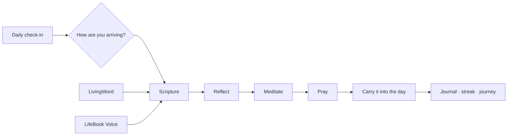
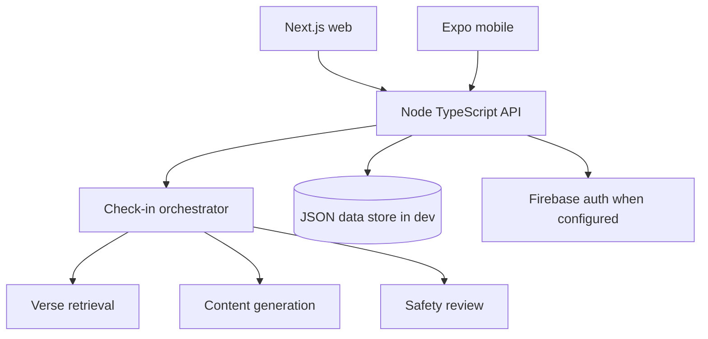

<div align="center">

# LifeBook

### A quieter way to walk with Jesus.

<p>Scripture · reflection · prayer · community</p>

<p>
  <a href="https://github.com/frank-asket/lifebook"></a>
  <a href="https://nextjs.org/"></a>
  <a href="https://nodejs.org/"></a>
  <a href="https://expo.dev/"></a>
</p>

<p><strong>LifeBook helps people meet God in the middle of real life.</strong><br>Come honestly. Sit with Scripture. Pray. Take the next faithful step.</p>

</div>

<div align="center">

```text
      ✦  CHECK IN  →  SCRIPTURE  →  REFLECT  →  PRAY  →  LIVE IT OUT  ✦
```

</div>

## What is LifeBook?

LifeBook is an AI-native Christian wellness platform built around the whole faith journey, including seasons of gratitude, peace, seeking, doubt, distance, and conviction.

It is not designed to replace a church, pastor, counselor, or Christian community. It is a quiet companion for personal practice that points people back to Scripture, prayer, and one another.

## The experience



### Home · a place to begin

Choose an honest spiritual state and receive a Scripture-grounded next step. LifeBook keeps the entry point simple so the practice can remain meaningful.

### Guided practice · five movements

Move through **Scripture → Reflect → Meditate → Pray → Complete** in one calm flow. Meditation includes real 2, 5, and 10-minute choices, and reflection can be saved to the journal.

### Journeys · faith grows one day at a time

Five-day journeys such as **Finding Peace**, **Growing in Faith**, and **Overcoming Fear** turn a single check-in into a rhythm of Scripture, prayer, and small faithful steps.

### LivingWord · hear teaching, stay with the Word

The web library is prepared for curated Christian teaching with:

- Teacher profiles and Scripture references
- Faith, Prayer, Hope, and Discipleship categories
- Audio and video-ready teaching pages
- Live gathering interface
- Reflection prompts and community comments

External preaching and recordings require explicit distribution rights. Until licensed recordings are connected, the interface clearly shows that audio is coming soon rather than fabricating a preacher's voice.

### LifeBook Voice · bring your questions

The web MVP supports tap-to-talk voice input and a Scripture-grounded conversation preview. The production version will connect to the backend orchestration layer, cite Scripture, respect theological differences, and escalate serious pastoral or crisis situations to human support.

## Repository map

| Area | Purpose | Start here |
| --- | --- | --- |
| `web/` | Next.js landing page, LifeBook Voice, LivingWord, teaching detail routes | [`web/README.md`](web/README.md) |
| `mobile/` | Expo / React Native app with onboarding, guided practice, community, library, and profile | [`mobile/App.tsx`](mobile/App.tsx) |
| `backend/` | Node.js / TypeScript API, agents, safety review, journeys, journal, community, and subscriptions | [`backend/README.md`](backend/README.md) |
| `docs/` | Product, technical, UX, flow, schema, and implementation documents | [`docs/`](docs/) |

## Run locally

### Web

```bash
cd web
npm install
npm run dev
```

Open [http://localhost:3000](http://localhost:3000). Current routes:

- `/` — LifeBook landing page
- `/voice` — LifeBook Voice web experience
- `/living-word` — LivingWord teaching library
- `/living-word/when-faith-feels-small` — teaching detail example

### Backend

```bash
cd backend
npm install
npm run dev
```

The API starts on `http://localhost:8787` with no API key required in development fallback mode.

```bash
curl http://localhost:8787/api/health
curl -X POST http://localhost:8787/api/checkin \
  -H 'Content-Type: application/json' \
  -d '{"deviceId":"me","mood":"peaceful"}'
```

### Mobile

```bash
cd mobile
npm install
npx expo start
```

Use Expo Go or an iOS/Android simulator. For a physical device, update the API base URL in `mobile/src/api/client.ts` to your computer's LAN IP.

## Architecture



The backend uses a zero-dependency JSON store for development. Production should move durable user data to Postgres, Firestore, or another managed database before public launch.

## Feature status

| Capability | Status |
| --- | --- |
| Onboarding and preferences | Built |
| Mood check-in and Scripture response | Built and tested |
| Guided Scripture / reflection / meditation / prayer flow | Built |
| Streaks, badges, journal, and favorite verses | Built and tested |
| Five-day journeys and mood recommendations | Built and tested |
| Groups, prayer requests, discussions, and moderation | Built and tested |
| Digital library and premium gating | Built |
| LivingWord web library and detail routes | Web experience built; licensed media pending |
| LifeBook Voice web MVP | Browser prototype built; backend orchestration pending |
| Real Firebase authentication | Written; live project verification pending |
| Push notification delivery | Written; real-device delivery pending |
| Payments | Mocked; processor integration pending |
| Licensed audio and video | Pending real recordings and distribution agreements |

The backend also includes independently runnable LivingWord and Voice services
on ports `8788` and `8789`; see [`backend/src/microservices/README.md`](backend/src/microservices/README.md).

## Development principles

- **Scripture first:** generated guidance should point back to approved Scripture and remain transparent about its source.
- **Honest states:** built, tested, user-validated, and production-ready are different claims.
- **Human care matters:** LifeBook does not replace pastors, churches, counselors, emergency services, or trusted relationships.
- **Content needs stewardship:** LivingWord requires licensing, theological review, moderation, and clear teacher attribution.
- **Privacy is part of discipleship:** mood, journal, voice, and prayer data need explicit retention and deletion controls.

## Before public launch

- Recruit 5–10 real users and observe the first-use experience.
- Complete theological review for generated guidance and LivingWord content.
- Connect a real database and configure persistent production storage.
- Verify Firebase authentication with a live project.
- Add a real payment provider if premium access remains part of the product.
- Record and license guided meditations, teachings, and live broadcasts.
- Publish privacy policy and terms of service.
- Complete security review, app-store assets, TestFlight, and internal Play testing.

## Product documents

- [Product Requirements](docs/LifeBook_PRD.pdf)
- [Technical Requirements](docs/LifeBook_TRD.pdf)
- [UI/UX Design](docs/LifeBook_UIUX_Design.pdf)
- [App Flow](docs/LifeBook_App_Flow.pdf)
- [Backend Schema](docs/LifeBook_Backend_Schema.pdf)
- [Implementation Plan](docs/LifeBook_Implementation_Plan.pdf)

<div align="center">

### “Abide in me, and I in you.” — John 15:4

Built with care for the journey of faith.

</div>
